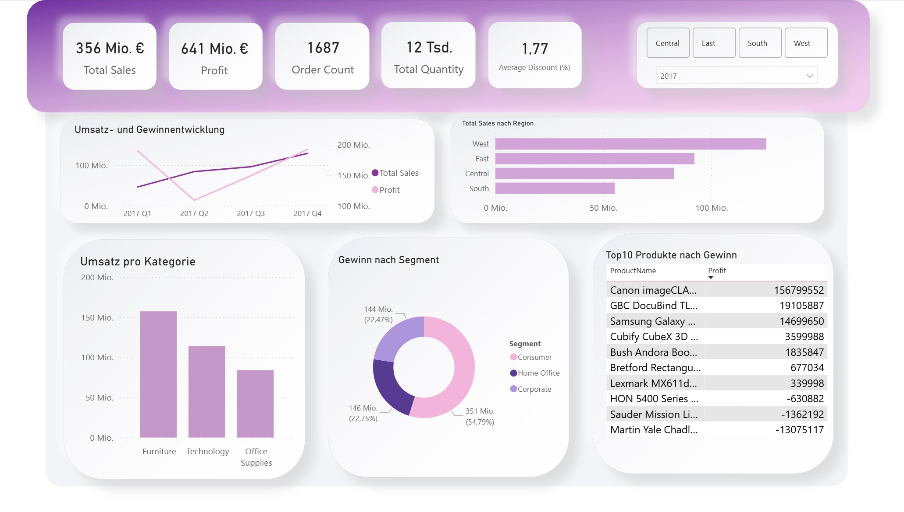
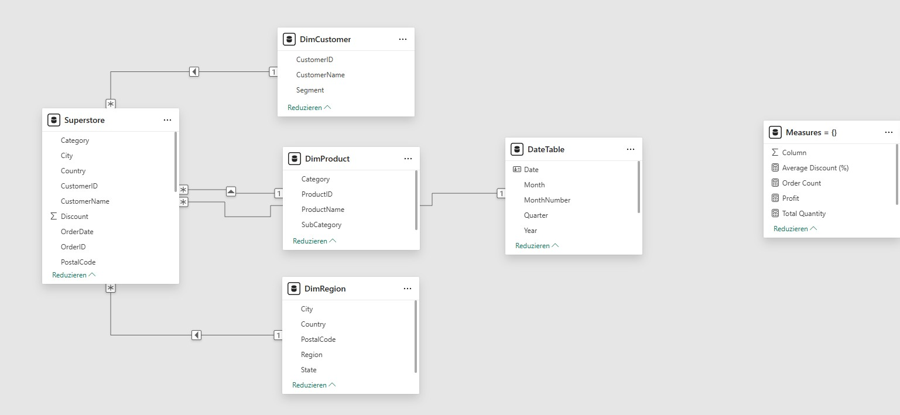

# project-sales-dashboard
 Sales Dashboard – Superstore Dataset
 
 
## 🧩 Problemstellung
Das Management eines Handelsunternehmens benötigt einen übersichtlichen Überblick über Umsatz, Bestellungen und Profitabilität.
Ziel ist ein interaktives Dashboard, das zeitliche Entwicklungen, Top-Produkte und regionale Unterschiede sichtbar macht.

## 🎯 Ziel des Projekts
Entwicklung eines Power BI Dashboards zur Unterstützung von datengetriebenen Entscheidungen im Vertrieb.

## 📌 Analyse-Scope & Business-Fragestellungen
Das Dashboard beantwortet unter anderem folgende Fragestellungen:

- Wie hoch sind Umsatz, Gewinn und Anzahl der Bestellungen insgesamt?
- Wie entwickeln sich Umsatz und Profit im Zeitverlauf?
- Welche Produktkategorien und Produkte tragen am stärksten zum Umsatz bei?
- Welche Kundensegmente sind am profitabelsten?
- Wie unterscheiden sich die Regionen in ihrer Performance?
- Gibt es saisonale Trends oder Auffälligkeiten?

## 📊 Datengrundlage
Verwendet wird das öffentlich verfügbare "Superstore Sales" Dataset (Kaggle).
Die Daten enthalten Informationen zu Bestellungen, Kunden, Produkten, Regionen und Umsätzen.

## 🧹 Datenaufbereitung & Modellierung

- Import und Bereinigung der Rohdaten in Power Query
- Standardisierung von Spaltennamen und Datentypen
- Korrekte Umwandlung von Datumsfeldern unter Berücksichtigung des US-Datumsformats
- Validierung der Datenqualität (keine fehlerhaften Datumswerte in kritischen Spalten)

### Datenmodell
- Aufbau eines sauberen Sternschemas (Star Schema)
- Zentrale Faktentabelle auf Order-Position-Ebene
- Erstellung separater Dimensionstabellen für:
  - Kunden
  - Produkte
  - Regionen
- Entfernung von Duplikaten ausschließlich in Dimensionstabellen
- Einsatz von einfachen (einseitigen) Beziehungen von Dimensionen zur Faktentabelle
- Überprüfung der Filterlogik mittels Dimension-basierten Slicern
  

## 🧭 Dashboard Design & Story

Das Dashboard wurde bewusst entlang typischer Management-Fragestellungen aufgebaut:

- Gesamtüberblick über Umsatz, Gewinn, Bestellungen, Menge und durchschnittlichen Rabatt
- Analyse der zeitlichen Entwicklung von Umsatz und Gewinn
- Vergleich der regionalen Performance
- Identifikation umsatzstarker Kategorien
- Analyse der profitabelsten Segmente
- Identifikation der profitabelsten Produkte (Top-10)

Die visuelle Struktur folgt dabei der Logik:

Überblick → Entwicklung → Performance-Treiber → Detailanalyse

Ziel ist es, sowohl eine schnelle Bewertung der Geschäftslage als auch eine vertiefende Analyse einzelner Bereiche zu ermöglichen.

## 📐 Zentrale KPIs

- Total Sales – Gesamtumsatz
- Profit – Gesamtgewinn
- Order Count – Anzahl eindeutiger Bestellungen
- Total Quantity – verkaufte Gesamtmenge
- Average Discount – durchschnittlicher gewährter Rabatt

## 🛠 Projektstatus & Vorgehen

- ✔ Datenbereinigung und Transformation in Power Query  
- ✔ Aufbau eines sauberen Datenmodells (Sternschema)  
- ✔ Definition zentraler KPIs (Umsatz, Gewinn, Bestellungen, Menge, durchschnittlicher Rabatt)  
- ✔ Erstellung eines interaktiven Management-Dashboards in Power BI  
- ✔ Umsetzung eines strukturierten Dashboard-Layouts (Überblick → Entwicklung → Treiber → Details)  
- ✔ Konzeption eines klaren Filter- und Interaktionskonzepts (Slicer + gezielte Cross-Filter)

## 🔧 Tools
- Power BI
- Power Query
- DAX
- Excel / CSV

## 📈 Erwarteter Business Mehrwert
Ein vergleichbares Dashboard kann das manuelle Monatsreporting ersetzen und Entscheidungen im Vertrieb und Management beschleunigen.

## 📌 Aktueller Stand

Das interaktive Dashboard ist vollständig umgesetzt.

Es enthält einen Management-Überblick mit zentralen KPIs, eine zeitliche Analyse von Umsatz und Gewinn, regionale und strukturelle Vergleiche sowie eine produktbezogene Detailanalyse inklusive Top-10-Ranking nach Profit.

Das Dashboard ist filterbar nach Region und Jahr und ermöglicht eine gezielte Exploration der Daten über ausgewählte Visual-Interaktionen.

## 📊 Enthaltene Visualisierungen (Auswahl)

- KPI-Übersicht (Sales, Profit, Orders, Quantity, Average Discount)
- Umsatz- und Gewinnentwicklung nach Quartal
- Umsatz nach Region
- Umsatz nach Kategorie
- Gewinn nach Segment
- Top-10 Produkte nach Gewinn

## 🔍 Zentrale Erkenntnisse (Key Insights)

- Der Umsatz und der Gewinn zeigen eine deutliche Saisonalität mit besonders starken Ergebnissen im vierten Quartal, was auf ein starkes Jahresendgeschäft hinweist.

- Ein vergleichsweise kleiner Teil der Produkte generiert einen großen Anteil des Gesamtgewinns, während viele Produkte nur geringe oder teilweise negative Profitabilität aufweisen.

- Zwischen den Regionen bestehen klare Performance-Unterschiede, sowohl im Umsatz als auch im Gewinn.

- Die Profitabilität unterscheidet sich deutlich zwischen den Kundensegmenten, obwohl sich die Umsätze der Segmente teilweise ähneln.

- Der durchschnittliche gewährte Rabatt steht in einem erkennbaren Spannungsverhältnis zur Profitabilität und stellt einen relevanten Hebel für Ergebnisverbesserungen dar.

## 🔁 Übertragbarkeit auf reale Unternehmensdaten

Das im Projekt umgesetzte Vorgehen (Datenaufbereitung, Datenmodellierung, KPI-Definition und Dashboard-Design) ist direkt auf reale Unternehmensdaten übertragbar, z. B. aus ERP-, Shop- oder CRM-Systemen.

Insbesondere eignet sich die Struktur des Dashboards für typische Anwendungsfälle wie:

- Vertriebs- und Umsatzreporting
- Produkt- und Sortimentsanalysen
- regionale Performancevergleiche
- Segment- und Kundenanalysen
- Management- und Monatsreportings

Das Projekt zeigt exemplarisch, wie aus operativen Rohdaten ein entscheidungsorientiertes Management-Dashboard aufgebaut werden kann.
